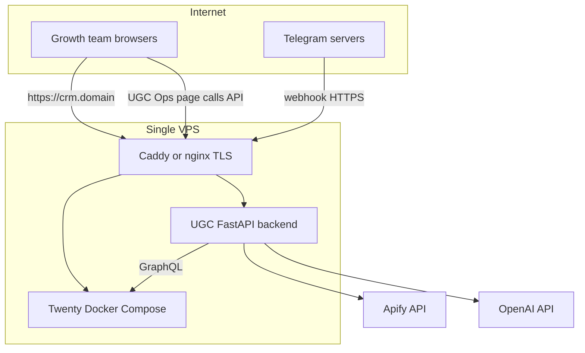

# Production deployment (VPS)

Guide for running UGC Hackflow outside local development: self-hosted Twenty, FastAPI backend, HTTPS, and Telegram webhooks on a **single VPS**.

This document is the deployment plan only—nothing here is applied automatically. See also [docs/self-hosted-twenty.md](docs/self-hosted-twenty.md) and [docs/architecture.md](docs/architecture.md).

## What you are deploying

Three runtime pieces plus external APIs:



| Service | Purpose | Public URL (example) |
|---------|---------|----------------------|
| **Twenty** | CRM UI, GraphQL API, logic functions | `https://crm.yourdomain.com` |
| **Backend** | Telegram webhook, intake API, Apify/AI jobs, reminders | `https://ugc-api.yourdomain.com` |
| **Telegram** | Mobile intake | Webhook points at backend only |

Apify and OpenAI are hosted APIs—configure tokens in backend env; no separate deploy.

## Local vs production

| Local (dev) | Production (VPS) |
|-------------|------------------|
| Twenty at `http://localhost:2020` (`yarn twenty docker:start`) | Twenty Docker Compose + `SERVER_URL=https://crm.yourdomain.com` |
| Backend at `http://localhost:8000` | Backend behind `https://ugc-api.yourdomain.com` |
| ngrok for Telegram HTTPS | Stable webhook URL on your domain |
| `backend/.env` on your machine | Secrets on server only (e.g. `/etc/ugc-ops/backend.env`) |
| `INTAKE_API_SECRET` optional | **Required** when `APP_ENV=production` |

---

## Phase 0 — Prerequisites

- **VPS:** at least 2 GB RAM, Ubuntu 22.04+ (or similar), static IP.
- **DNS:** two A records, e.g. `crm` and `ugc-api` → VPS IP.
- **Production secrets** (do not reuse local dev values):
  - Twenty: `ENCRYPTION_KEY`, Postgres password, `SERVER_URL`
  - `TWENTY_API_KEY` (created in the production workspace)
  - `TELEGRAM_BOT_TOKEN`, `TELEGRAM_WEBHOOK_SECRET`
  - `APIFY_TOKEN`, per-platform actor IDs, `OPENAI_API_KEY`
  - `INTAKE_API_SECRET` (required for `APP_ENV=production`; see [backend/app/config.py](backend/app/config.py))
- **Enrichment pipeline:** fix known backend issues before expecting Creator Review fields to auto-fill (Apify actor ID URL encoding, `get_campaign` GraphQL)—see [backend/README.md](backend/README.md).

---

## Phase 1 — Twenty on the VPS (system of record)

Use [Twenty self-host Docker Compose](https://docs.twenty.com/developers/self-host/capabilities/docker-compose), not the local app-dev server.

1. Install Docker and Docker Compose on the VPS.
2. Download Twenty’s production `docker-compose.yml` and `.env` from the official Twenty repository.
3. Set production `.env` (minimum):
   - `SERVER_URL=https://crm.yourdomain.com`
   - Strong `PG_DATABASE_PASSWORD`, `ENCRYPTION_KEY`, `APP_SECRET`
4. Start: `docker compose up -d`.
5. Complete first-time workspace setup in the browser.
6. Terminate TLS with **Caddy or nginx** (Let’s Encrypt) on port 443.
7. **Backups:** daily Postgres snapshot or `pg_dump` cron; test a restore once.

On the same host, the backend may call Twenty via internal URL (`http://127.0.0.1:<api-port>`) while browsers use `https://crm.yourdomain.com`.

---

## Phase 2 — Sync the UGC Twenty app to production

Deploy custom objects, views, and logic functions from your machine or CI:

1. In production Twenty: **Settings → API** → create an API key.
2. From [twenty-app-official/](twenty-app-official/):

```bash
export TWENTY_API_URL=https://crm.yourdomain.com
export TWENTY_API_KEY=<production-key>
yarn install
yarn twenty dev --once
```

This syncs Creator Database, Creator Review, Creator Operations, logic functions (`approve-candidate-handoff`, `apply-outreach-follow-up`), and the UGC Ops intake page.

**CI:** [twenty-app-official/.github/workflows/cd.yml](twenty-app-official/.github/workflows/cd.yml) can deploy on push if you set GitHub secrets `TWENTY_DEPLOY_API_KEY` and point `TWENTY_DEPLOY_URL` at production (today it defaults to localhost).

---

## Phase 3 — Deploy the FastAPI backend

There is no backend Dockerfile in this repo yet. Recommended MVP: **systemd + venv**.

### Option A — systemd + venv (recommended MVP)

1. Clone the repo on the VPS:

```bash
git clone https://github.com/khanhngoo/UGC_hackflow.git
cd UGC_hackflow/backend
python3 -m venv .venv
.venv/bin/pip install -e .
```

2. Create `/etc/ugc-ops/backend.env` (mode `600`) from [.env.example](.env.example):

| Variable | Production value |
|----------|------------------|
| `APP_ENV` | `production` |
| `TWENTY_API_URL` | `https://crm.yourdomain.com` or internal `http://127.0.0.1:<api-port>` |
| `TWENTY_APP_URL` | `https://crm.yourdomain.com` |
| `TWENTY_API_KEY` | production workspace API key |
| `INTAKE_API_SECRET` | long random string |
| `INTAKE_CORS_ORIGINS` | `https://crm.yourdomain.com` |
| `TELEGRAM_*`, `APIFY_*`, `OPENAI_*` | production tokens |

3. Run uvicorn bound to localhost (expose only via reverse proxy):

```bash
.venv/bin/uvicorn app.main:app --host 127.0.0.1 --port 8000
```

4. Configure a **systemd** unit to restart on boot; load env from `/etc/ugc-ops/backend.env`.

5. Reverse proxy: `https://ugc-api.yourdomain.com` → `127.0.0.1:8000`.

### Option B — Docker (later)

Add `backend/Dockerfile` and a compose service on the same VPS; use the same environment variables.

### Verify

```bash
curl https://ugc-api.yourdomain.com/health
```

Expect `"status": "ok"` and `twentyConfigured`, `telegramConfigured`, etc. as `true` when secrets are set.

---

## Phase 4 — Telegram (no ngrok)

Telegram requires a **public HTTPS** URL. The bot token in `.env` alone does not connect Telegram to your server—you must register a webhook.

1. Backend must be reachable at `https://ugc-api.yourdomain.com`.
2. Register the webhook:

```bash
curl "https://api.telegram.org/bot<TOKEN>/setWebhook" \
  -d "url=https://ugc-api.yourdomain.com/webhooks/telegram" \
  -d "secret_token=<TELEGRAM_WEBHOOK_SECRET>"
```

3. Verify:

```bash
curl "https://api.telegram.org/bot<TOKEN>/getWebhookInfo"
```

4. Restrict users with `TELEGRAM_ALLOWED_USER_IDS` (comma-separated Telegram user IDs).

The bot only receives messages while the backend process is running and the webhook URL is current. Re-run `setWebhook` if you change domains or certificates.

---

## Phase 5 — Twenty UI intake (UGC Ops page)

The form in [twenty-app-official/src/front-components/main-page.tsx](twenty-app-official/src/front-components/main-page.tsx) calls the backend URL from [twenty-app-official/src/constants/intake-api.ts](twenty-app-official/src/constants/intake-api.ts).

Before syncing to production:

1. Set `UGC_BACKEND_URL` to `https://ugc-api.yourdomain.com`.
2. Run `yarn twenty dev --once` against production.

**Security:** Do not ship `INTAKE_API_SECRET` in the front-end bundle for a public internet deployment ([docs/workflows.md](docs/workflows.md)). Options:

- **MVP:** Use Telegram intake only in production until a server-side proxy exists.
- Restrict CRM access via VPN or IP allowlist.
- Add a BFF/proxy on Twenty’s host (future).

With `APP_ENV=production`, the backend refuses to start without `INTAKE_API_SECRET`—align Twenty UI intake with your secret strategy before going live.

---

## Phase 6 — Background jobs and reminders

| Job | Behavior today | Production |
|-----|----------------|------------|
| Apify + AI after intake | `asyncio.create_task` in [backend/app/services/enrichment_runner.py](backend/app/services/enrichment_runner.py) | Runs inside the uvicorn process; use **one backend instance** |
| Follow-up reminders | `POST /jobs/send-reminders` | Cron on VPS, e.g. daily: `curl -X POST https://ugc-api.yourdomain.com/jobs/send-reminders` |
| Manual enrichment / AI | `POST /jobs/enrich-creator`, `POST /jobs/summarize-creator` | Protect with firewall or admin-only access |

**Telegram conversation state** is stored **in memory** ([backend/README.md](backend/README.md)). Restarting the backend clears in-progress intakes. For multiple replicas, add Redis-backed state (not implemented yet)—until then, run a single backend worker.

---

## Phase 7 — Operations checklist

- [ ] HTTPS on `crm` and `ugc-api` hostnames; HTTP redirects to HTTPS
- [ ] Secrets only on the server; never commit `.env`
- [ ] Monitor `GET /health` (Uptime Kuma, Better Stack, etc.)
- [ ] Twenty Postgres backups and a tested restore
- [ ] Document upgrade path: Twenty `docker compose pull` + `yarn twenty dev --once`
- [ ] Separate local and production API keys and bot tokens
- [ ] Rotate keys that were ever shared in chat or screenshots

---

## Suggested order of execution

1. VPS, DNS, TLS reverse proxy  
2. Twenty production Docker, admin user, API key  
3. `yarn twenty dev --once` → production workspace  
4. Backend systemd (or Docker), production env, `/health` OK  
5. `setWebhook` for Telegram  
6. Update `UGC_BACKEND_URL` and re-sync app (if using Twenty UI intake)  
7. Cron for `/jobs/send-reminders`  
8. End-to-end test: Telegram intake → Creator Review → approve → Creator Operations  

---

## End-to-end test (production)

1. Message the bot: profile link → product → campaign → reason.  
2. In Twenty: new card on **Creator Review**; check **Integration Events** for `TELEGRAM_INTAKE_SUCCEEDED`, then `APIFY_*` and `AI_SUMMARY_*`.  
3. Approve a candidate → **Creator Operations** outreach card (logic function).  
4. Set `lastContactedAt` on outreach → `nextFollowUpAt` updates (logic function).

---

## Related docs

- [README.md](README.md) — local setup and team workflow  
- [backend/README.md](backend/README.md) — API endpoints and env vars  
- [docs/self-hosted-twenty.md](docs/self-hosted-twenty.md) — Twenty local and VPS notes  
- [milestone.md](milestone.md) — feature status  
