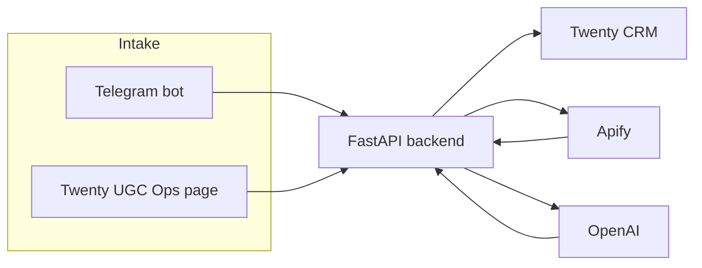

# UGC Hackflow (UGC Campaign Ops)

Internal UGC campaign operations tool for the **EveryLab Growth Team**. It turns scattered creator discoveries (TikTok, Instagram, YouTube Shorts, X, DMs, spreadsheets) into a structured workflow: propose → review → approve → outreach → follow-up.

**Not** a creator marketplace, generic CRM, or auto-DM product. Twenty is the workspace; the backend handles bots and external APIs.

## How it fits together



| Component | Role |
|-----------|------|
| **Twenty** (`twenty-app-official/`) | System of record: creators, candidates, outreach, kanbans, logic functions |
| **Backend** (`backend/`) | Telegram webhook, Twenty UI intake API, Apify enrichment, OpenAI tagging, reminders |
| **Telegram bot** | Mobile intake: link → product → campaign → reason |
| **Apify** | Optional profile stats after intake (best-effort) |
| **OpenAI** | Optional niche, tags, and fit ratings after intake (best-effort) |

## Repository structure

| Path | Description |
|------|-------------|
| [`twenty-app-official/`](twenty-app-official/) | Official Twenty app: objects, views, kanbans, logic functions |
| [`backend/`](backend/) | FastAPI service — see [backend/README.md](backend/README.md) |
| [`docs/`](docs/) | [Architecture](docs/architecture.md), [data model](docs/data-model.md), [workflows](docs/workflows.md) |
| [`.env.example`](.env.example) | Environment template — copy to `backend/.env` |
| [`PRD.md`](PRD.md) | Full product requirements |
| [`milestone.md`](milestone.md) | Build status and milestones |

## Prerequisites

- **Python 3.11+** — use `backend/.venv` (system Python 3.10 fails on `StrEnum`)
- **Node 20+** and **Yarn** for the Twenty app
- **Docker** for local Twenty (`yarn twenty docker:start`)
- **Optional:** [ngrok](https://ngrok.com) for Telegram webhooks (HTTPS required)

## Setup

### A. Twenty (CRM)

```bash
cd twenty-app-official
yarn install
yarn twenty docker:start    # http://localhost:2020
yarn twenty dev --once      # sync objects, views, logic functions
```

Log in with default dev credentials (see [twenty-app-official/README.md](twenty-app-official/README.md)).

### B. Backend

```bash
cd backend
python3 -m venv .venv
.venv/bin/pip install -e ".[dev]"
cp ../.env.example .env      # fill TWENTY_API_KEY, TELEGRAM_*, APIFY_*, OPENAI_*, etc.
.venv/bin/uvicorn app.main:app --host 0.0.0.0 --port 8000
```

Verify:

```bash
curl http://localhost:8000/health
```

Generate a Twenty API key in the workspace settings, or use `~/.twenty/config.json` from `yarn twenty remote:add`.

### C. Telegram webhook (optional — mobile intake)

Telegram pushes messages to your server; the bot token in `.env` alone is not enough.

1. Start the backend on port `8000`.
2. Expose HTTPS, e.g. `ngrok http 8000`.
3. Register the webhook (replace placeholders; do not commit real tokens):

```bash
curl "https://api.telegram.org/bot<TOKEN>/setWebhook" \
  -d "url=https://<NGROK_HOST>/webhooks/telegram" \
  -d "secret_token=<TELEGRAM_WEBHOOK_SECRET>"
```

Check status: `curl "https://api.telegram.org/bot<TOKEN>/getWebhookInfo"`

Notes:

- `TELEGRAM_ALLOWED_USER_IDS` limits which Telegram users can use the bot.
- ngrok free URLs change on restart — run `setWebhook` again after each tunnel restart.

### D. Twenty UI intake

1. Keep Twenty and the backend running.
2. Open Twenty → **UGC Ops** (home page widget).
3. If the API is not on `http://localhost:8000`, update `UGC_BACKEND_URL` in `twenty-app-official/src/constants/intake-api.ts`.
4. Set `INTAKE_CORS_ORIGINS` (default `http://localhost:2020`). See [backend/README.md](backend/README.md) for `INTAKE_API_SECRET`.

## Team workflow

1. **Propose a creator** — **Telegram:** send profile link → pick product number → campaign number → reason. **Or Twenty UI:** paste URL, select product/campaign, enter reason on **UGC Ops**.
2. **Background enrichment** — Apify updates follower/views on `Creator` and candidate snapshots; OpenAI suggests niche, tags, and brand/audience star ratings. Failures are logged as `IntegrationEvent` and do not block intake.
3. **Creator Review** — kanban on `CampaignCreatorCandidate` grouped by `pipelineStatus` (Proposed → Under Review → Approved / Rejected / etc.).
4. **Approve to contact** — drag to **Approved to Contact** on the same candidate row; `approve-candidate-handoff` syncs denormalized `Creator` fields; card appears on **Creator Operations** (no separate outreach record).
5. **Outreach and follow-up** — on the candidate, log `lastContactedAt`; `apply-outreach-follow-up` sets `nextFollowUpAt` (+3 days when still no reply). Optional overdue reminders: `POST /jobs/send-reminders`.

Details and acceptance criteria: [docs/workflows.md](docs/workflows.md).

## Further reading

- [PRODUCTION.md](PRODUCTION.md) — VPS deployment, HTTPS, Telegram webhook, production env
- [backend/README.md](backend/README.md) — API endpoints, Apify, AI summary, reminders
- [docs/architecture.md](docs/architecture.md) — system boundaries and failure rules
- [milestone.md](milestone.md) — what is built vs planned (M7 contact workflows, M8 messaging, etc.)

## Security

- **Never commit** `.env` or API keys. Use [`.env.example`](.env.example) only.
- Rotate any key that was shared in chat, logs, or screenshots.
