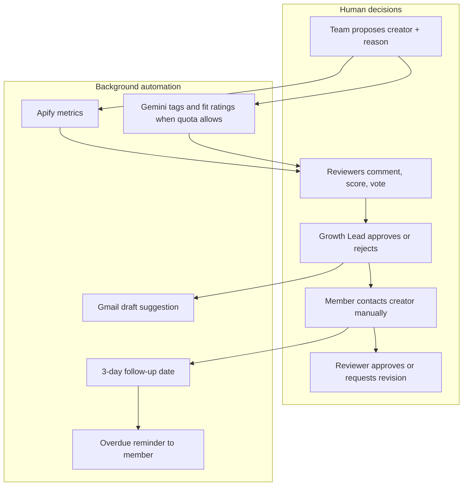
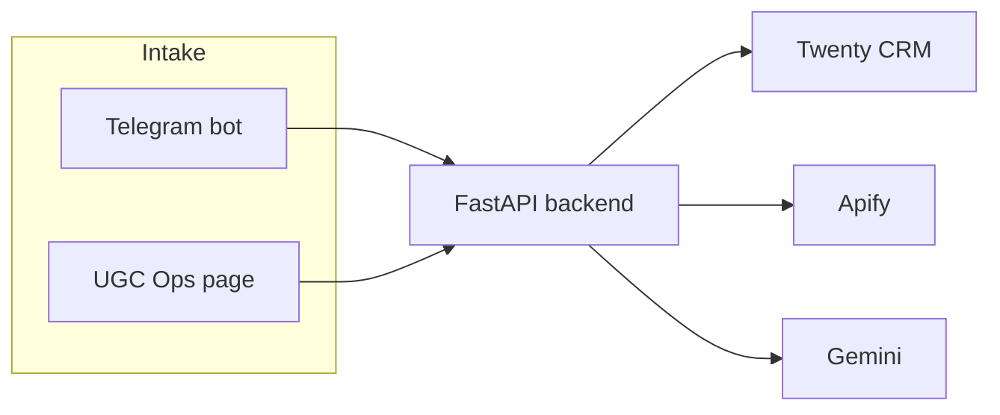

# UGC Hackflow

Highly customizable creator-ops CRM with automated management for the **EveryLab Growth Team**. Growth teammates only need to find good UGC creators while scrolling in their free time; UGC Hackflow automatically tracks, enriches, organizes, and manages the creator workflow across review, outreach, documents, campaigns, follow-ups, and reporting so members spend less mental space chasing records and more time dealing with preferred creators.

Twenty CRM is the workspace your team works in every day. A FastAPI backend connects Telegram, Apify, and Gemini to fill in data and send reminders. **Humans stay in control** at every decision point.

**Production status:** M15 pilot launch is complete. The production-level website/workspace is deployed for real team use; local setup below is mainly for engineers who need to develop or troubleshoot the system.

**Current production limitations:**

- **Gemini quota:** some AI features are disabled or run selectively because of Gemini API quota limits, including Twenty's built-in AI query experience and the AI status-management engine.
- **Apify credit:** profile scraping is limited by the remaining free Apify balance (about **$4**). For this first version, assume fewer than **100 creators** can be scraped before adding more credit or reducing scrape usage.
- **Platform coverage:** TikTok scraping is not fully implemented yet due to time constraints. The current automated enrichment pipeline is production-ready for **Instagram UGC creators only**.

---

## What the product does

| Feature | What you get |
|---------|----------------|
| **Fast creator intake** | Propose a creator in under 30 seconds from **Telegram** (mobile) or the **UGC Ops** page in Twenty (desktop). |
| **Structured creator pipeline** | Every lead becomes a campaign-specific creator row tied to product, campaign, and reason — not a lost chat message. |
| **Automatic enrichment** | Apify pulls Instagram profile stats (followers, views, likes, engagement rate, posting cadence). Instagram reel shares resolve to the real `@username`; TikTok scraping is not fully implemented yet. |
| **AI-assisted tagging** | Gemini can suggest **niche**, **tags**, and **brand/audience fit** star ratings when quota is available. Output is advisory — reviewers can override. |
| **Team review board** | **Creator Review** kanban for Proposed → Under Review → Approved / Rejected / Duplicate. |
| **Operations pipeline** | **Creator Operations** kanban tracks outreach from Approved to Contact through Content Submitted. |
| **Follow-up discipline** | Log `lastContactedAt`; the system schedules a 3-day nudge when there is no reply. Calendar view + Telegram reminders. |
| **Content review** | **Content Review** kanban for submitted assets, revisions, approval, and ad-test readiness. |
| **Creator database** | One table of all creators across campaigns with metrics, review status, and pipeline stage. |
| **Conversation intelligence** | Gmail sync, message threads, and **Email Drafts** (draft-only — no auto-send). Manual log for Instagram/TikTok DMs. Some AI status automation may be disabled under Gemini quota limits. |
| **Audit trail** | **Integration Events** log Apify/Gemini success, skip, and failure without blocking intake. |

**Not in scope:** creator marketplace, bulk scraping platform, generic CRM, or unsupervised auto-messaging.

---

## Human-in-the-loop by design

Automation handles repetitive data gathering. People make the calls that matter.



| Step | Who acts | What the system does |
|------|----------|----------------------|
| **Propose** | Growth teammate | Normalizes the link, deduplicates by platform + profile, and creates a campaign-specific Creator pipeline row. |
| **Enrich / tag** | Nobody (optional) | Fills metrics and AI fields in the background when quota/credit is available. Failures are logged; the card still appears for review. |
| **Review** | Reviewers + Growth Lead | Kanban, comments, evaluations, fit fields. AI ratings are hints, not decisions. |
| **Approve to contact** | Growth Lead | Drag to **Approved to Contact** → card moves to **Creator Operations**. |
| **Outreach** | Assigned member | Sends DMs/email manually. Updates `lastContactedAt` and `replyStatus` on the record. |
| **Follow-up** | Member (with nudge) | System sets `nextFollowUpAt` after contact with no reply; reminders go to the assigned member. |
| **Content** | Reviewer | Uses `submissionLink`, `revisionNotes`, and pipeline moves on **Content Review**. |
| **Email drafts** | Member | AI may suggest a draft in Gmail; sending stays manual. |

---

## End-to-end workflow

### 1. Propose a creator

**Telegram (mobile):** send a profile or reel link → pick product number → campaign number → one-line reason.

**Twenty UI (desktop):** open **UGC Ops** → paste URL → select product and campaign → enter reason → **Submit for review**.

Both paths create the same records and queue the same background jobs.

### 2. Background enrichment (best-effort)

After intake, the backend runs:

1. **Apify** — Instagram follower count, avg/median views, likes, comments, engagement rate, posts in last 30 days, last post date.
2. **Gemini** — niche, tags, and brand/audience fit stars when quota is available.

If either provider fails, intake still succeeds. Check **Integration Events** for details.

### 3. Creator Review

Open **Creator Review** in the Twenty sidebar. Cards move through:

`Proposed` → `Under Review` → `Approved to Contact` / `Rejected` / `Duplicate` / `Needs More Info`

Use engagement metrics and AI fit fields to decide. Multiple reviewers can evaluate the same creator record.

### 4. Creator Operations

When approved, the same record appears on **Creator Operations**:

`Approved to Contact` → `Contacted` → `Replied` → … → `Content Submitted`

Assign a **member**, log contact dates, and track reply status. The follow-up calendar shows upcoming and overdue tasks.

### 5. Content Review

After content is submitted, work the card on **Content Review**:

`Content Submitted` → `Needs Revision` → `Approved` → `Ready for Ad Test` → `Closed`

Campaign brief fields live on the **Campaigns** view.

### 6. Creator Database

**Creator Database** is the cross-campaign table: identity, links, metrics, review status, pipeline stage, and ops timing — useful for comparing creators and reporting.

Full acceptance criteria: [docs/workflows.md](docs/workflows.md).

---

## Workspace views (Twenty sidebar)

| View | Purpose |
|------|---------|
| **UGC Ops** | Submit a creator from the browser |
| **Creator Review** | Team evaluation and approve/reject |
| **Creator Operations** | Outreach and pipeline through content submission |
| **Content Review** | Asset review and revision loop |
| **Creator Database** | All creators, all campaigns |
| **Campaigns** | Campaign goals and brief fields |
| **Conversations** | Message threads per creator |
| **Email Drafts** | Gmail drafts linked to pipeline rows |

After deploying app changes, run `yarn view-filters:clear` in `twenty-app-official/` and hard-refresh Twenty if kanban filters look stale.

---

## Architecture (brief)



| Component | Role |
|-----------|------|
| **Twenty** (`twenty-app-official/`) | System of record — objects, kanbans, logic functions, team UI |
| **Backend** (`backend/`) | Webhooks, intake API, enrichment, AI summary, reminders, Gmail sync |
| **Telegram bot** | Mobile intake gateway |
| **Apify** | Profile enrichment (optional) |
| **Gemini** | Niche, tags, fit ratings (optional) |

Details: [docs/architecture.md](docs/architecture.md) · [docs/data-model.md](docs/data-model.md)

---

## Getting started

Start here if you are on the Growth Team. The production workspace is already deployed; you do not need to run the code locally.

- **[Using the deployed workspace](#using-the-deployed-workspace)** — open the CRM website and register with the Telegram bot.
- **[Local development](#local-development)** — run Twenty + backend on your machine if you are changing the product.

---

### Using the deployed workspace

Use this for the deployed production workspace.

#### Access

| Service | URL |
|---------|-----|
| **Twenty CRM website** | https://crm.everylab-ugc.online |
| **Telegram bot** | https://t.me/everylab_ugc_bot |
| **Backend health** | https://ugc-api.everylab-ugc.online/health |

If the bare domain `https://everylab-ugc.online` does not load, use the CRM subdomain above. The app is hosted at `crm.everylab-ugc.online`.

#### Telegram setup for Growth teammates

Use Telegram for fast mobile creator intake while scrolling.

1. Open https://t.me/everylab_ugc_bot.
2. Ask an admin for the private team invite code and register once:

```text
/start YOUR_TEAM_CODE
```

3. Send an Instagram creator profile or reel link.
4. Pick the product number from the bot's list.
5. Pick the campaign number.
6. Send one short reason, for example: `Good student audience, natural facecam style`.
7. The creator appears in Twenty under **Creator Review**.

TikTok links can be submitted as records, but automated scraping is not fully implemented yet. For this version, use Instagram creators when you expect enrichment metrics.

#### CRM setup for reviewers and operators

Use the CRM website for review, outreach, content tracking, and campaign operations.

1. Open https://crm.everylab-ugc.online.
2. Sign in with your invited account. If you do not have access, an admin should invite you from **Settings → Members → Invite**.
3. Use **Creator Review** to approve, reject, or request more info.
4. Use **Creator Operations** to assign owners, contact creators, and update `lastContactedAt` / `replyStatus`.
5. Use **Follow-up Calendar** to see upcoming and overdue follow-ups.
6. Use **Content Review** to track submitted content, revisions, approval, and ad-test readiness.
7. Use **Conversations** and **Email Drafts** when handling Gmail-backed outreach.

Telegram registration and CRM access are separate. A submitter can propose creators from Telegram without a CRM login, while reviewers and operators need CRM access.

#### Daily workflow

1. **Find a creator** while scrolling.
2. **Submit on Telegram** with profile link → product → campaign → reason, or submit on desktop through **UGC Ops** in the CRM.
3. **Review** on **Creator Review** — check Instagram metrics, AI tags if available, and team comments.
4. **Operate** on **Creator Operations** — assign a member, contact the creator, and track reply/deal/content status.
5. **Follow up** from the calendar or Telegram reminders.
6. **Review content** on **Content Review** when the creator sends assets.

Instagram enrichment runs automatically while Apify credit is available; TikTok scraping is not fully implemented in this version. Gemini-backed AI fields and status automation may be disabled under quota limits. If metrics are empty, an admin can check **Integration Events** or re-trigger enrichment (see backend docs).

---

### Local development

Use this only if you are developing or debugging the system locally. Daily Growth Team usage should happen through the deployed workspace above.

**Prerequisites:** Python 3.11+, Node 20+, Yarn, Docker. Optional: [ngrok](https://ngrok.com) for Telegram webhooks (HTTPS required).

#### 1. Start Twenty locally

```bash
cd twenty-app-official
yarn install
yarn twenty docker:start          # http://localhost:2020
yarn twenty dev --once            # sync objects, views, logic functions
```

Log in with default dev credentials (see [twenty-app-official/README.md](twenty-app-official/README.md)).

#### 2. Create a local backend env file

```bash
cd backend
python3 -m venv .venv
.venv/bin/pip install -e ".[dev]"
cp ../.env.example .env
```

Fill `backend/.env` before starting the backend.

Minimum local values:

```bash
APP_ENV=local
TWENTY_API_URL=http://localhost:2020
TWENTY_APP_URL=http://localhost:2020
TWENTY_API_KEY=<local Twenty API key>
INTAKE_CORS_ORIGINS=http://localhost:2020
```

Create `TWENTY_API_KEY` in the local Twenty workspace settings, or use the API key stored by `yarn twenty remote:add` in `~/.twenty/config.json`.

Telegram intake values:

```bash
TELEGRAM_BOT_TOKEN=<BotFather token>
TELEGRAM_WEBHOOK_SECRET=<random local secret>
TELEGRAM_TEAM_INVITE_CODE=<team code for local testing>
TELEGRAM_REGISTERED_USERS_FILE=/tmp/ugc-ops-telegram-registered-users.json
TELEGRAM_ALLOWED_USER_IDS=
```

Apify Instagram enrichment values:

```bash
APIFY_TOKEN=<Apify API token>
APIFY_INSTAGRAM_POST_ACTOR_ID=apify/instagram-scraper
APIFY_INSTAGRAM_PROFILE_ACTOR_ID=apify/instagram-profile-scraper
```

TikTok scraper support is not complete in this version. Leave `APIFY_TIKTOK_ACTOR_ID` empty unless you are actively working on TikTok enrichment.

Gemini values:

```bash
GEMINI_API_KEY=<Google AI Studio key>
GEMINI_MODEL=gemini-2.5-flash
CONVERSATION_DRAFTING_ENABLED=false
CONVERSATION_AI_CLASSIFICATION_ENABLED=false
```

Gmail conversation sync is optional. If you need it, follow [docs/GMAIL_SETUP.md](docs/GMAIL_SETUP.md) and then set:

```bash
GOOGLE_OAUTH_CLIENT_ID=<Google OAuth client id>
GOOGLE_OAUTH_CLIENT_SECRET=<Google OAuth client secret>
GMAIL_OAUTH_REDIRECT_URI=http://localhost:8000/auth/google/gmail/callback
GMAIL_SYNC_MAILBOX=<growth mailbox>
GMAIL_SYNC_INTERVAL_SECONDS=60
```

For local browser intake, leave `INTAKE_API_SECRET` empty unless you specifically want to test secret enforcement.

#### 3. Start the backend

```bash
.venv/bin/uvicorn app.main:app --host 0.0.0.0 --port 8000
```

Verify:

```bash
curl http://localhost:8000/health
```

Expected local result: `"status": "ok"` and `twentyConfigured: true` after the Twenty API key is set.

#### 4. Configure the local UGC Ops page

The Twenty front component calls the backend URL from `twenty-app-official/src/constants/intake-api.ts`. For default local development it should point at:

```ts
http://localhost:8000
```

If you change that value, re-sync the Twenty app:

```bash
cd twenty-app-official
yarn twenty dev --once
```

#### 5. Telegram webhook for local testing

Telegram requires HTTPS. With ngrok:

```bash
ngrok http 8000
curl "https://api.telegram.org/bot<TOKEN>/setWebhook" \
  -d "url=https://<NGROK_HOST>/webhooks/telegram" \
  -d "secret_token=<TELEGRAM_WEBHOOK_SECRET>"
```

Re-run `setWebhook` after each ngrok restart. In production, the bot webhook points to `https://ugc-api.everylab-ugc.online/webhooks/telegram`; see [PRODUCTION.md](PRODUCTION.md#phase-4--telegram-no-ngrok).

Register with your local team code:

```text
/start <TELEGRAM_TEAM_INVITE_CODE>
```

Then send an Instagram creator link and follow the bot prompts.

#### 6. Test the local flow

1. Submit a creator from **UGC Ops** in Twenty or from the Telegram bot.
2. Confirm the card on **Creator Review**.
3. If Apify/Gemini are configured, wait for Instagram metrics and AI fields.
4. Move the card through **Creator Review**, **Creator Operations**, and **Content Review**.

Useful checks:

```bash
curl http://localhost:8000/intake/options
curl -X POST http://localhost:8000/jobs/sync-gmail
```

Backend API details: [backend/README.md](backend/README.md)

---

## Repository map

| Path | Description |
|------|-------------|
| [`twenty-app-official/`](twenty-app-official/) | Twenty app — objects, views, kanbans, logic functions |
| [`backend/`](backend/) | FastAPI integration service |
| [`deploy/`](deploy/) | VPS install and deploy scripts |
| [`docs/`](docs/) | Architecture, data model, workflows |
| [`.env.example`](.env.example) | Environment template → copy to `backend/.env` |
| [`PRD.md`](PRD.md) | Full product requirements |
| [`milestone.md`](milestone.md) | Build status |

---

## Further reading

- [PRODUCTION.md](PRODUCTION.md) — VPS deployment, HTTPS, production env
- [backend/README.md](backend/README.md) — API endpoints, Apify, Gemini, Gmail, reminders
- [docs/workflows.md](docs/workflows.md) — step-by-step workflows and acceptance criteria
- [docs/GMAIL_SETUP.md](docs/GMAIL_SETUP.md) — Gmail OAuth and inbox sync

---

## Security

- **Never commit** `.env` or API keys. Use [`.env.example`](.env.example) only.
- Rotate any key that was shared in chat, logs, or screenshots.
- In production, set `INTAKE_API_SECRET` and do not embed secrets in the Twenty front-end bundle.
